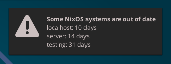

== nixos-update-reminder

_nixos-update-reminder_ queries the nixpkgs revision from a host and displays
a desktop notification when it is older than a given threshold.

.Screenshot of a notification

To use _nixos-update-reminder_ add the following to your NixOS configuration:

[source,nix]
include::example.nix[]

Multiple hosts can be queried like this:

[source,nix]
include::example-hosts.nix[]

=== NixOS Module Options

include::options.adoc[leveloffset=+2]
